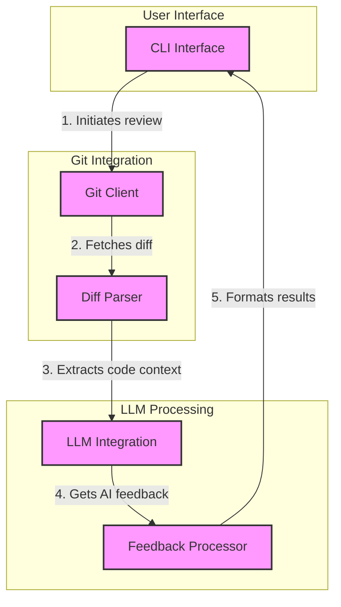
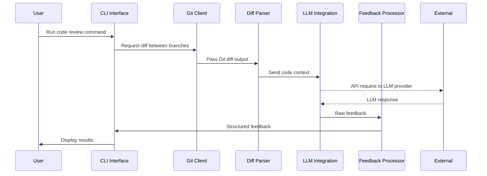
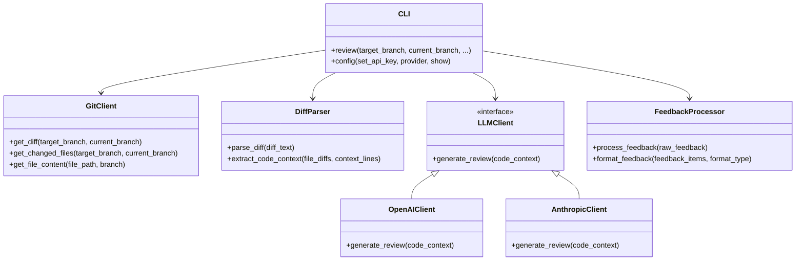
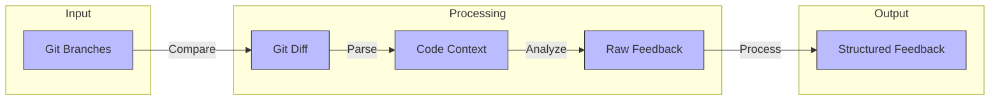

# AI Code Review Tool - Architecture Diagram

## Component Flow Diagram

```mermaid
graph TD
    subgraph "User Interface"
        CLI[CLI Interface]:::component
    end

    subgraph "Git Integration"
        GC[Git Client]:::component
        DP[Diff Parser]:::component
    end

    subgraph "LLM Processing"
        LLM[LLM Integration]:::component
        FP[Feedback Processor]:::component
    end

    CLI -->|1. Initiates review| GC
    GC -->|2. Fetches diff| DP
    DP -->|3. Extracts code context| LLM
    LLM -->|4. Gets AI feedback| FP
    FP -->|5. Formats results| CLI

    classDef component fill:#f9f,stroke:#333,stroke-width:2px;
```

## Sequence Diagram

```mermaid
sequenceDiagram
    participant User
    participant CLI as CLI Interface
    participant GC as Git Client
    participant DP as Diff Parser
    participant LLM as LLM Integration
    participant FP as Feedback Processor

    User->>CLI: Run code review command
    CLI->>GC: Request diff between branches
    GC->>DP: Pass Git diff output
    DP->>LLM: Send code context
    LLM-->>External: API request to LLM provider
    External-->>LLM: LLM response
    LLM->>FP: Raw feedback
    FP->>CLI: Structured feedback
    CLI->>User: Display results
```

## Component Diagram

```mermaid
classDiagram
    class GitClient {
        +get_diff(target_branch, current_branch)
        +get_changed_files(target_branch, current_branch)
        +get_file_content(file_path, branch)
    }

    class DiffParser {
        +parse_diff(diff_text)
        +extract_code_context(file_diffs, context_lines)
    }

    class LLMClient {
        <<interface>>
        +generate_review(code_context)
    }

    class OpenAIClient {
        +generate_review(code_context)
    }

    class AnthropicClient {
        +generate_review(code_context)
    }

    class FeedbackProcessor {
        +process_feedback(raw_feedback)
        +format_feedback(feedback_items, format_type)
    }

    class CLI {
        +review(target_branch, current_branch, ...)
        +config(set_api_key, provider, show)
    }

    LLMClient <|-- OpenAIClient
    LLMClient <|-- AnthropicClient
    CLI --> GitClient
    CLI --> DiffParser
    CLI --> LLMClient
    CLI --> FeedbackProcessor
```

## Data Flow Diagram

```mermaid
graph LR
    subgraph "Input"
        GB[Git Branches]:::data
    end

    subgraph "Processing"
        GD[Git Diff]:::data
        CC[Code Context]:::data
        RF[Raw Feedback]:::data
    end

    subgraph "Output"
        SF[Structured Feedback]:::data
    end

    GB -->|Compare| GD
    GD -->|Parse| CC
    CC -->|Analyze| RF
    RF -->|Process| SF

    classDef data fill:#bbf,stroke:#333,stroke-width:1px;
```
